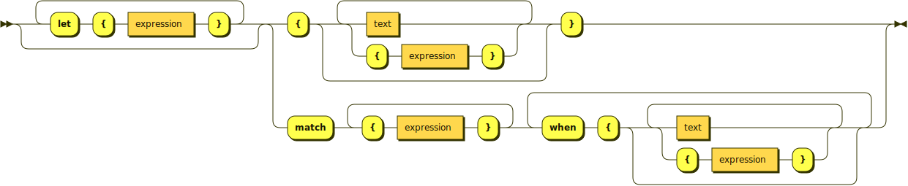

# message2

An experimental reference implementation of the [MessageFormat 2](https://github.com/unicode-org/message-format-wg) standard in TypeScript.

```js
let message = new MessageFormat("en-US", "{Hello, {$userName}!}");
let value = message.format({userName: new RuntimeString("Alice")}),
assert.equal(value, "Hello, Alice!");
```

For more information about the message syntax, consult the upstream [spec/syntax.md](https://github.com/unicode-org/message-format-wg/blob/main/spec/syntax.md).

## Goals of This Implementation

This is a rsearch project, currently not intended for production use.

* Follow the spec development and provide an additional implementation.
* Validate the ideas discussed in MFWG through an implementation.
* Demonstrate one concrete parsing and runtime model to help these discussions.

Additionally, I attempted to follow the principles and guidelines listed below:

* Strict conformance to the spec.
* All formatting and matching functions implemented as custom functions in userspace.
* No `any` or `unknown`; use interfaces and generics instead.
* No shortcuts nor special cases in the code.
* Optimize the code for dicussion and review.

## Overview

The codebase is organized in the following directories:

* `syntax` — the parser and the definition of the AST data model.
* `runtime` — the `MessageFormat` class which parses and formats messages.
* `registry` — implementations of formatting and matching functions.
* `command` — CLI tools which can be used for testing and inspecting the behavior of the implementation.
* `example` — examples of messages and custom functions; they also double as tests.

Remember to compile TypeScript to JavaScript before you run the examples and CLI tools.

    $ npm install
	$ npx tsc

## Parsing

Parsing is divided into three steps:

* *scanning* for "atoms" based on whitespace and word boundary characters, such as `{`, `}`, `=`, etc.,
* *lexing* which consists of categorizing the atoms into tokens based on their values and the analyzed position in the source,
* and finally *parsing* which builds the AST from the stream of tokens.

Due to MessageFormat's use of curly braces as delimiters for both text and expressions, the lexing step requires an almost complete analysis of the source according to the formal grammar. Consider the process of deciding whether an atom is part of a text production or part of an expression:


 <sup>generated by [RR - Railroad Diagram Generator](https://bottlecaps.de/rr/ui)</sup>

Since the lexical analysis is already quite advanced, I decided to perform a complete verification of well-formedness in the lexer. The lexer checks whether option names are valid `name` productions, whether option names are followed by an equals sign, whether option values are valid nmtokens, variable names, or literals, whether the variant keys are separated by whitespace, etc. This leaves little work for the parser, which in fact is mostly concerned about building a tree out of the stream of tokens. Most grammar-related errors are caught during the lexical analysis.

While the lexer generates a flat stream of categorized tokens, the parser produces an AST, defined in [`syntax/ast.ts`](syntax/ast.ts). The AST is then used by the runtime to format translations.

## Runtime

The runtime exposes the `MessageFormat` class. The goal of that class is to:

* take a string with the contents of a single message,
* parse it to an AST,
* format it to either a string or an iterator of parts
* using interpolated data provided at the callsite (i.e. the "message arguments").

It is intended as a prototype of the future [`Intl.MessageFormat` API](https://github.com/tc39/proposal-intl-messageformat).

```js
let message = new MessageFormat("en-US", "{Hello, {$userName}!}");

// Format the message to a string.
let value = message.format({userName: new RuntimeString("Alice")}),
assert.equal(value, "Hello, Alice!");

// Format the message to an iterator of parts.
let iter = message.formatToParts({userName: new RuntimeString("Bob")});
assert.deepEqual(iter.next().value, {type: "literal", value: "Hello, "});
assert.deepEqual(iter.next().value, {type: "literal", value: "Bob"});
assert.deepEqual(iter.next().value, {type: "literal", value: "!"});
assert.equal(iter.next().done, true);
```

I'm still working on the implementation of `MessageFormat`. Currently, the following parts are missing or require more discussion:

- [ ] Handle errors according to the [spec draft](https://github.com/unicode-org/message-format-wg/blob/main/spec/formatting.md#error-handling).
- [ ] (Maybe) allow passing native JavaScript types, such as `string`, `number`, and `Date` as message arguments. 
- [ ] Decide on the shape and types of parts yielded by `formatToParts`.
- [ ] Establish a model for error handling of registry functions.

## Registry

The registry contains implementations of formatting and matching functions. All functions available in `message2` are registered functions, even `:number` and `:plural`. The goal is to ensure that registered functions can be as powerful and expressive as necessary. Some modules in the registry also provide custom runtime types. For instance, [`registry/number.ts`](registry/number.ts) provides `RuntimeNumber` which formats numbers and matches them by value; [`registry/plural.ts`](registry/plural.ts) provides `RuntimePlural` which matches numbers by value and by LDML plural category.

The only type built into the runtime rather than the registry is the [`RuntimeString`](runtime/RuntimeString.js), which is the runtime representation of `ast.Literal`.

## Examples

* `example/example_string.ts` is a simple example showing how to interpolate string data (`$userName`) into a pattern.

* `example/example_number.ts` showcases locale-aware number and unit formatting for English and French, using [`registry/number.ts`](registry/number.ts).

* `example/example_plural.ts` showcases plural selection using [`registry/plural.ts`](registry/plural.ts), as well as a message with two selectors: `$photoCount` and `$userGender`.

* `example/example_apples.ts` demonstrates how the plural selector can inspect a number's `minimumFractionDigits` formatting option to select the variant matching the number's formatting.

* `example/example_accord.ts` features two fairly complex formatters for grammatical features: [`registry/noun.ts`](registry/noun.ts) and [`registry/adjective.ts`](registry/adjective.ts). They are used in Polish to accord an adjective's grammatical gender, case, and number with the object of the sentence. The object is represented as an instance of `PolishNoun`. The adjective is represented as an instance of `PolishAdjective`, and can inspect the grammatical properties of the object. Both implement the `RuntimeValue` interface.

* `example/example_list.ts` is an exploration into list formatting and plural selection based on the list's length: [`registry/list.ts`](registry/list.ts). It defines the custom `RuntimeList` value class, which can store and format an array of other runtime values. This example also introduces the custom `Person` value class in [`registry/person.ts`](registry/person.ts), along with two custom functions for formatting `Person` instances: `:person` which formats a single `Person`, and `:person.each` which accepts a *list* of `Person` instances and applies the `:person` function to each of them. I'll admit this is a bit cursed, but I wanted to attempt doing something complex in custom functions without adding too much complexity to the message itself.

* `example/example_opaque.ts` takes advantage of the `formatToParts()` iterator which yields formatted pattern parts with metadata to pass an opaque unstringifiable value into a message and position it in the sentence.

You can run all examples at once with:

    $ npm test

Each example can also be run individually, provided the project is first compiled with `npx tsc`:

    $ node example/example_string.js

## Command Line

* `node command/lex.mjs` to print a list of tokens recognized by the lexer.
* `node command/parse.mjs` to print a JSON representation of the AST parsed by the parser.

Both tools take `stdin` as input, or can be passed a path to a text file containing a single message. When trying out things, it's convenient to take advantage of process substitution, available in bash and zsh:

    $ node parse.mjs <(echo "{Hello, world!}")
